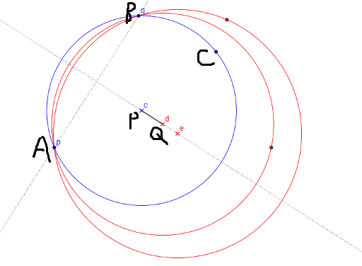
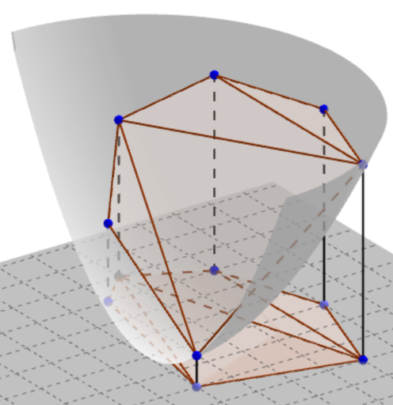

##### 一些观察

令 $A$ 为圆内的点集， $B$ 为圆外的点集

显然可以认为，当存在一个圆，使得 $A$ 中的点都在圆内或圆上， $B$ 中的点都在圆外时，题目有解

若 $A$ 中只有一个点，显然有解

若 $|A|>1$ ，容易看出如果题目有解，那么肯定存在一个解使得 $A$ 中至少有两个点在圆上

##### 算法一

考虑枚举 $A$ 中的两个点，那么圆心一定在两点连线的中垂线上

对于其他 $A​$ 中的点和 $B​$ 中的点，每个点必须在圆内或者必须在圆外，那么会得到一个圆心坐标的可行区间

下面的图片给出了一个例子，图中点 $A,B$ 为枚举点，那么要使点 $C$ 在圆内，圆心只能在射线 $PQ$ 上 

于是不难得到一个复杂度为 $O((n^2+m^2)(n+m))$ 的算法，可以通过子任务1

##### 算法二

容易发现可以将算法一中的枚举改为在点集凸包上进行

##### 算法三

容易发现随机数据跑得会很快，因此每次枚举点对之前现将点集 random_shuffle 一下

可以通过子任务2

##### 算法四

猜想最终并不需要枚举 $n^2$ 级别的点对， emm... 考虑转化问题

将原平面作为 $z=0$ 平面，将问题放到三维坐标系中讨论，画出抛物面 $z=x^2+y^2$

考虑抛物面和一个不与 $z=0$ 垂直的平面相交得到的截面在 $z=0$ 上的投影

假设平面为 $ax+by+z=c$ 

那么 $x^2+ax+y^2+by=c$ ，即 $(x+\frac{a}{2})^2+(y+\frac{b}{2})^2=c+\frac{a^2+b^2}{4}$ 

通过方程可以看出投影一定是一个圆

那么考虑将 $z=0$ 上的点 $(x,y,0)$ 映射到 $(x,y,x^2+y^2)$ ，这是一一对应的

也就是说 $z=0$ 上的一个圆对应一个抛物面的截面，容易发现圆内的点一定在对应平面下方，圆外的点一定在对应平面上方，圆上的点一定在对应平面上

于是问题转化为求一个平面，将抛物面上两点集分开，使得一点集在平面上方，另一点集在平面下方或平面上

类比于平面上的情况，可以知道如果有解，则一定存在一个答案平面经过下方点集的上凸壳上两点，容易证明这两点一定在上凸壳上相邻，即对应上凸壳的一条边

然后考虑上凸壳的边在 $z=0$ 上的正投影，容易发现投影会是平面上对应凸包的一个剖分，当不存在四点共圆时，形成三角剖分，否则将其补成三角剖分，可以看看下面的图

由之前的讨论可知，需要枚举的点对就只有原凸包上的相邻点和剖分中的边的两端点

考虑这个剖分的特征，回到凸壳上考虑，对于凸壳的每一个面，凸壳必然在其所在平面下面，对应到平面上就是凸包必然在三角剖分后每个三角形的外接圆内部

所以只需要找到一个这样的剖分，需要枚举的边数就降到凸包的点数级别了

考虑求出一个这样的剖分，考虑分治，在凸包上按逆（顺）时针讨论， $solve(l,r)$ 表示将点 $l$ 到点 $r$ 剖分

将 $(l,r)$ 这条边作为底边，找到一个点 $k,(l<k<r)$ ，使得这三个点构成三角形的外接圆最大，可以证明这个三角形会包含整个凸包，然后递归做 $solve(l,k),solve(k,r)$ 就好了

最后套用算法一，可以通过本题

复杂度低于 $n^2$ , 可能需要一定的优化

##### 其他

本题来自 [Codeforces 549E](http://codeforces.com/contest/549/problem/E) ，数据造水了，可能放过了一些乱搞，但 $\rm CF$ 原题数据可以被算法三跑过 